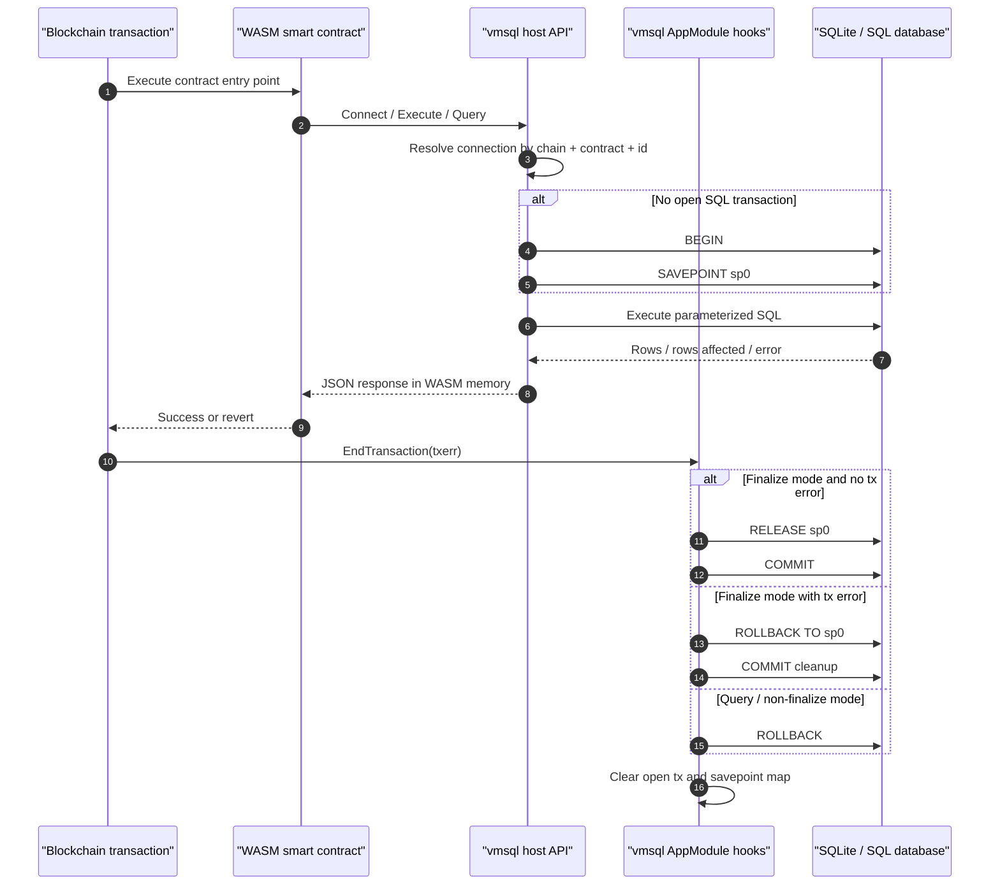

# Deterministic SQL Transactions

Source anchors:
- `wasmx/x/vmsql/ops.go`: `Connect`, `Execute`, `BatchAtomic`, `Query`, `beginDbTx`
- `wasmx/x/vmsql/module.go`: `EndTransaction`
- `tests/vmsql/sqlite_test.go`: rollback and nested rollback coverage
