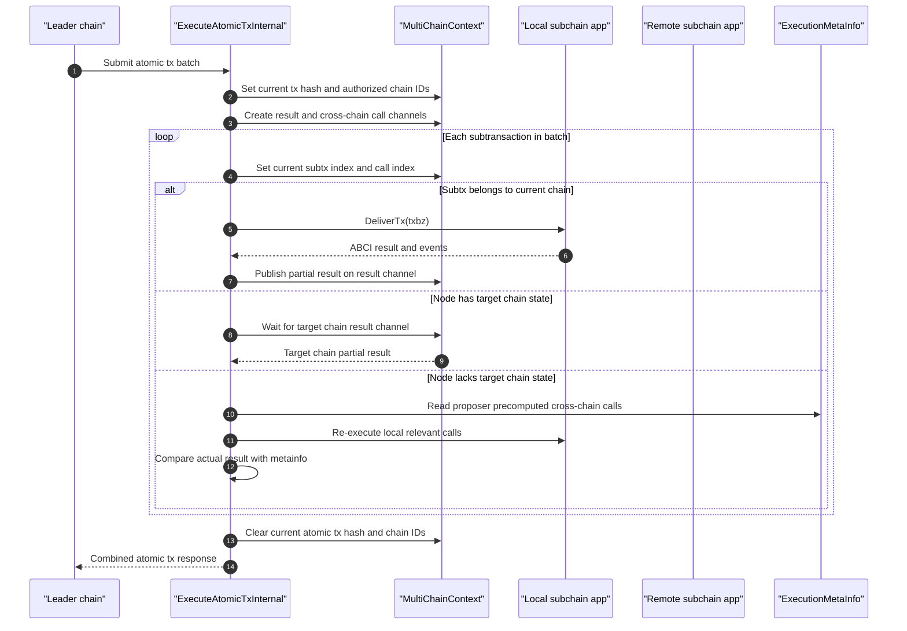

# Atomic Cross-Chain Transactions

The transaction batch behaves like an ordered event log across multiple state machines. Nodes that have all affected chains execute directly; nodes with partial state consume deterministic metainfo produced earlier and verify local replay against expected results.

Each subchain behaves like an ordered partition, and the atomic transaction coordinator enforces ordering, correlation IDs, timeouts, and replay validation across partitions.

Source anchors:
- `ARCHITECTURE.md`: optimistic execution and atomic cross-chain notes
- `wasmx/x/network/keeper/multichain.go`: `ExecuteAtomicTxInternal`, `ExecuteCrossChainTxInternal`
- `wasmx/x/network/types/ctx_metainfo_crosschain.go`: deterministic cross-chain call metainfo
