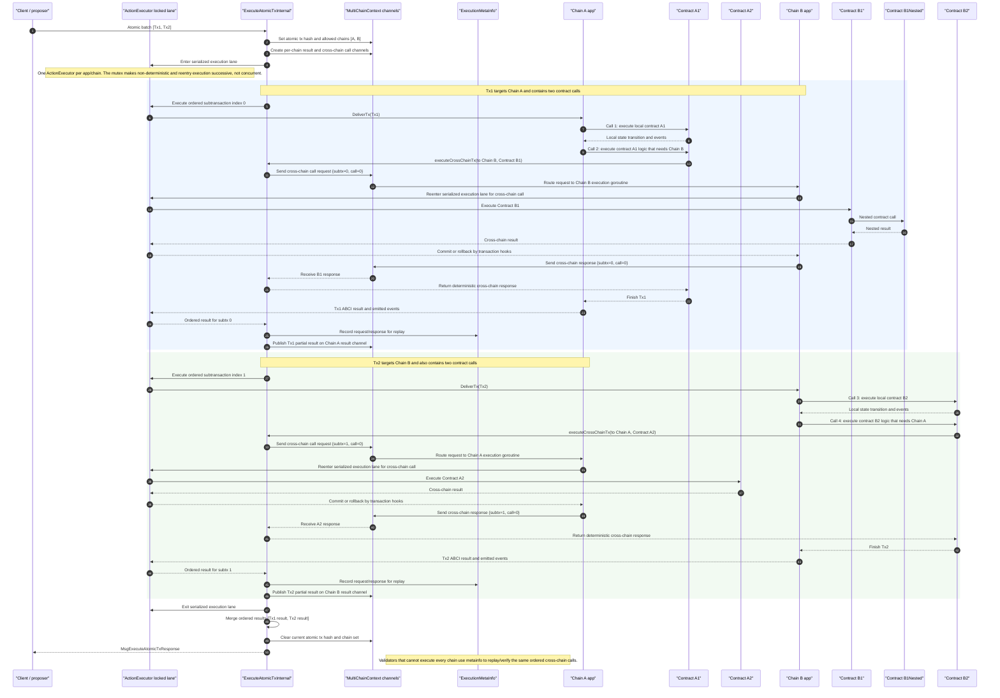

# Atomic Cross-Chain Example: Two Transactions With Nested Call

## What This Shows

The atomic batch is the outer transaction boundary. Inside it, each subtransaction is executed in a deterministic order through the `ActionExecutor` serialized lane. Cross-chain reentries also pass back through that same execution discipline, so they are successive and transaction-hooked rather than free-running goroutines.

A cross-chain contract call is treated as an indexed internal call: `(atomic tx hash, subtx index, cross-chain call index)`.

The nested call under `Contract B1` is still a normal contract subcall inside Chain B execution. It is not a new atomic subtransaction; it is part of the call tree for `Tx1`'s cross-chain call.

Source anchors:
- `wasmx/x/network/keeper/executor.go`: locked `ActionExecutor` and transaction hooks
- `wasmx/x/network/keeper/multichain.go`: atomic batch loop, channels, cross-chain call timeout
- `wasmx/x/network/vmcrosschain/ops.go`: contract-facing cross-chain host API
- `wasmx/x/network/types/ctx_metainfo_crosschain.go`: cross-chain request/response metainfo
- `wasmx/x/wasmx/vm/ops_common.go`: nested contract call handling
