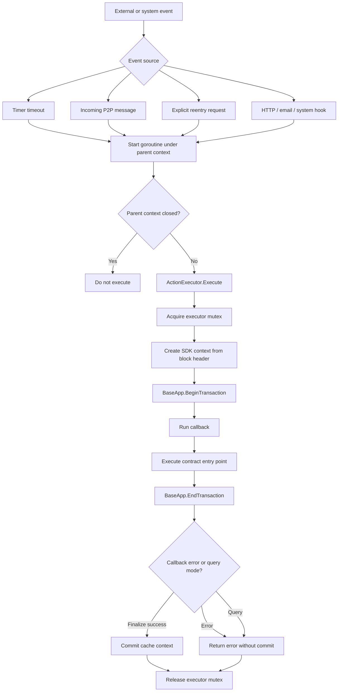

# ActionExecutor Reentry

WasmX allows asynchronous events to trigger contract execution, but those executions cannot mutate shared state arbitrarily. They are funneled through one serialized executor per app/chain, which gives every reentry the same transaction hooks and commit rules as deterministic transaction execution.

Source anchors:
- `wasmx/x/network/keeper/executor.go`: `ActionExecutor`
- `wasmx/x/network/keeper/keeper_timeout.go`: timer-triggered reentry
- `wasmx/x/network/keeper/keeper_p2p.go`: P2P-triggered reentry
- `wasmx/x/network/keeper/keeper_reentry_gor.go`: goroutine-backed reentry
