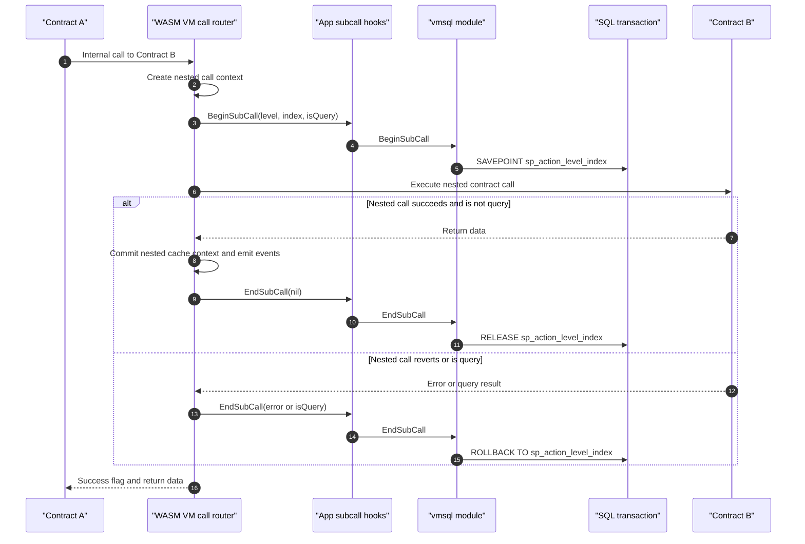

# Nested Contract Call Savepoint Hooks

Implementation detail behind deterministic SQL. The VM already tracks nested contract call level and index. I used that execution structure as instrumentation: each nested call gets a unique SQL savepoint, so inner call failures and query-only paths roll back without corrupting the outer transaction.

Source anchors:
- `wasmx/x/wasmx/vm/ops_common.go`: nested context and `BeginSubCall` / `EndSubCall`
- `wasmx/x/vmsql/module.go`: savepoint naming and rollback/release logic
- `tests/vmsql/sqlite_test.go`: nested call rollback scenarios
