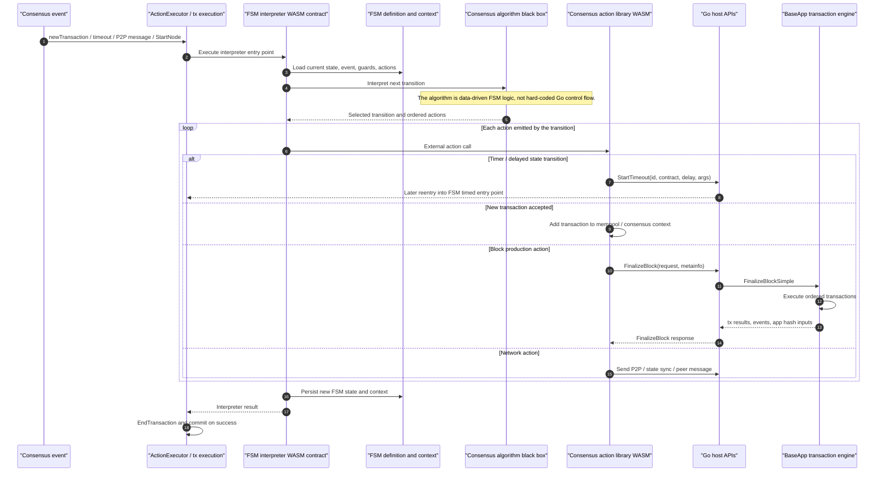

# FSM-Driven Consensus Contracts

Consensus behavior is expressed as FSM data plus WASM contracts. Go provides host APIs, networking, timers, and transaction boundaries, but the consensus flow is interpreted by the FSM interpreter WASM contract.

A consensus event does not directly run hard-coded Go logic. It enters a WASM interpreter, the interpreter evaluates the current FSM state and transition table, then the selected actions can start concrete transaction execution through host APIs such as `FinalizeBlock`.

Source anchors:
- `ARCHITECTURE.md`: transaction cycles, block end, and reentry model
- `tests/testdata/tinygo/wasmx-fsm/cmd/main.go`: FSM interpreter entry points
- `tests/testdata/tinygo/wasmx-fsm/lib/machine.go`: FSM transition execution and timer integration
- `tests/testdata/tinygo/wasmx-raft-lib/lib/actions.go`: consensus actions that finalize blocks
- `wasmx/x/network/keeper/keeper_timeout.go`: timed reentry
- `wasmx/x/wasmx/vm/ops_wasmx_consensus.go`: host `FinalizeBlock` API
